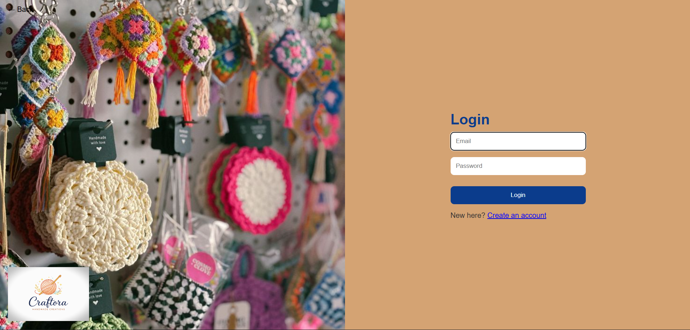
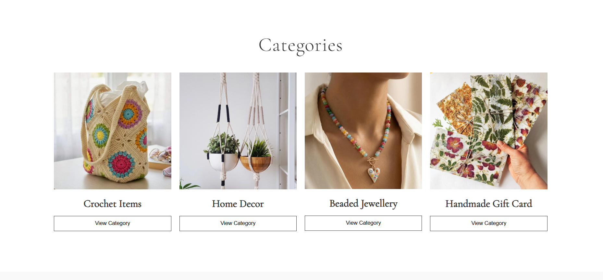
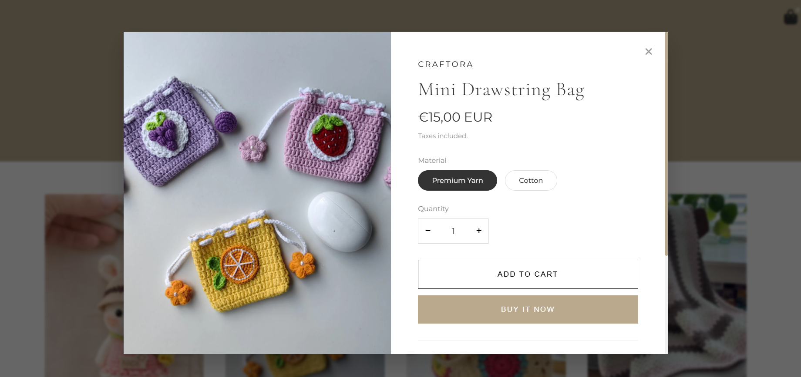
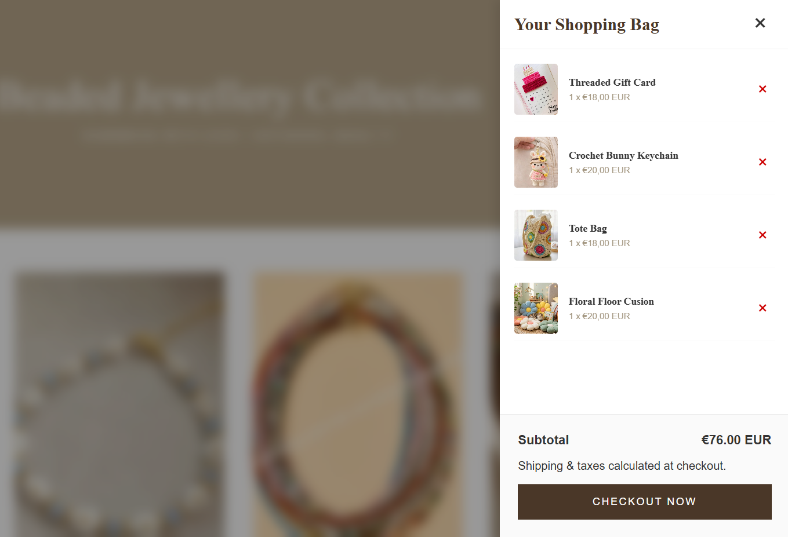
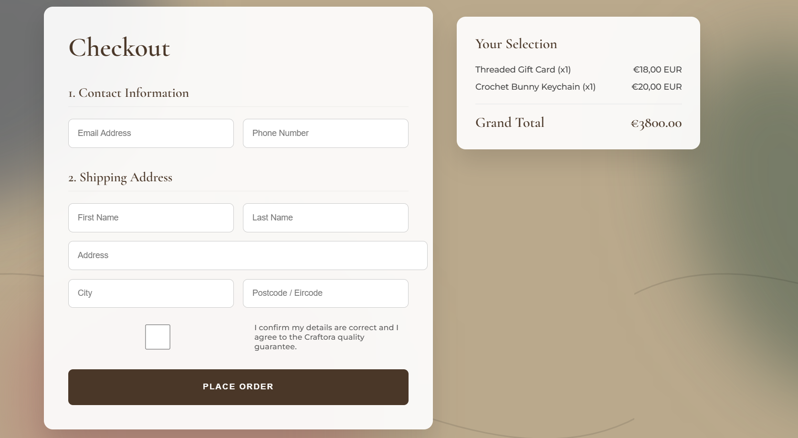
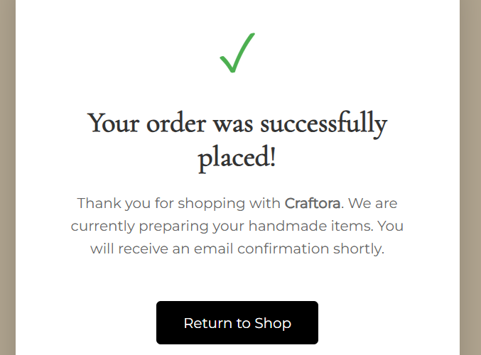

# 🛍️ Craftora – Handmade Products Marketplace

Craftora is a modern e-commerce platform designed to showcase and sell unique handmade products. Built using Flask, Python, SQLite, HTML, CSS, and JavaScript, the platform provides a seamless shopping experience with user authentication, product browsing, and shopping cart functionality.

---

## ✨ Features

### 🔐 User Authentication
- User Registration
- Secure Login System

### 🏠 Interactive Homepage
- Attractive landing page
- Featured handmade collections
- Easy navigation

### 🛍️ Product Catalog
- Browse handmade products
- Product descriptions and pricing
- Organized product display

### 🛒 Shopping Cart
- Add products to cart
- Manage selected items
- Review purchases before checkout

### 💾 Database Integration
- SQLite database for storing user and product information
- Efficient data management

### 🎨 Responsive Design
- Clean and user-friendly interface
- Consistent styling across all pages using a centralized CSS file

---

## 🛠️ Technologies Used

- 🐍 Python
- 🌶️ Flask
- 🗄️ SQLite
- 🌐 HTML5
- 🎨 CSS3
- ⚡ JavaScript

---

## 📂 Project Structure

```text
Craftora/
│
├── app.py
├── templates/
│   ├── index.html
│   ├── login.html
│   ├── register.html
│   ├── products.html
│   └── cart.html
│
├── static/
│   ├── css/
│   │   └── style.css
│   ├── js/
│   │   └── script.js
│   └── images/
│
├── craftora.db
├── requirements.txt
└── README.md
```

---

## 📸 Screenshots

### 🏠 Homepage


### 🔐 Login Page


### 🛍️ Categories Page


### 🛍️ Products Page


### 🛒 Shopping Cart


### 💳 Checkout Page


### ✅ Order Success Page


---

## 🎯 Learning Outcomes

Through this project, I gained practical experience in:

- Full-Stack Web Development
- Flask Framework
- Database Design and Management
- User Authentication
- Front-End Development
- Responsive Web Design
- Project Organization and Deployment

---

## 🚀 Future Enhancements

- 💳 Online Payment Integration
- ⭐ Product Reviews & Ratings
- 🤖 AI-Based Product Recommendations
- 📊 Sales Analytics Dashboard
- 📦 Order Tracking System

---

## 👩‍💻 Developed By

**Hiba Shaikh**

Aspiring Data Scientist | Python Enthusiast | Data Analytics & Machine Learning Learner

---

## 🙏 Acknowledgements

This project was developed as part of my learning journey in web development and database integration.

### 🎨 Website Design Inspiration
The website layout and design were inspired by the following template:

- Julia Shopify Theme by Studio Zash
- https://studiozash.com/julia-shopify-theme

### 📚 Learning Resources
For understanding Flask database connectivity and implementation concepts, I referred to tutorials and educational content from:

- Tech With Tim
- YouTube: @TechWithTim

I would like to thank the creators for providing valuable resources that contributed to the development of this project.

### 🌟 If you found this project interesting, consider giving it a star!
